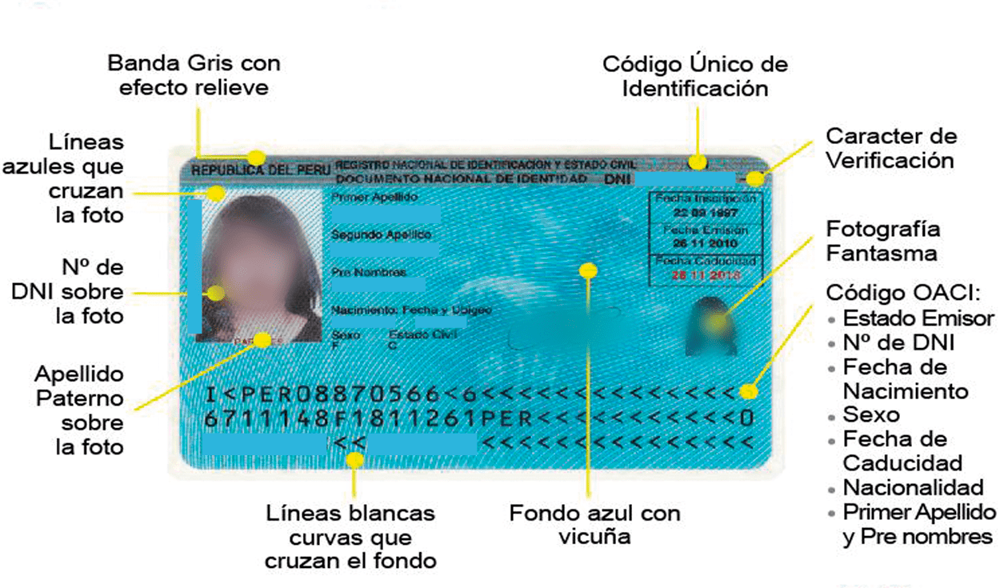

## Lector de DNIs Peruanos

Este es un lector de DNI Peruanos, que permite leer el código de barras de los DNI Peruanos y extraer la información de los mismos.

Existen 4 versiones de DNIs:

## DNI Antiguo
* ### Para Adultos - 1997

Este documento tiene un código PDF417 en la parte posterior del documento, que contiene la siguiente información:

| Bytes   | Campo                                                         | Ejemplo                                                    |
|---------|---------------------------------------------------------------|------------------------------------------------------------|
| 0-1     | NI                                                            | 01                                                         |
| 2-9     | Número de documento                                           | 45595338                                                   |
| 10-49   | Primer Apellido                                               | Castillo                                                   |
| 50-89   | Segundo apellido                                              | Ceferino                                                   |
| 90-124  | Nombres (separados por un espacio)                            | Norman Valery                                              |
| 125     | Sexo                                                          | 1: Masculino, 2: Femenino                                  |
| 448-455 | Fecha en formato yyyy/MM/DD                                   | 20270425 (equivalente a 25/04/2027 o 25 de Abril del 2027) |
| 456-463 | Código de ficha (Sirve como medida adicional de verificación) | 87260138                                                   |
| 464-471 | Código de ficha (Sirve como medida adicional de verificación) | 87260138                                                   |

También contiene la información dactilar del usuario

Ejemplo de código PDF417:

* ### Para Menores - 1997

### DNI Electrónico
* 2013 
Tiene el chip en la parte de atrás

Ver https://www.gob.pe/11747-conoce-el-codigo-de-ficha-de-dni

* 2020
Tiene el chip en la parte frontal

# Cosas comunes

Todos los DNIS tiene códigos MRZ en el formato TD1

El cual tiene los siguientes campos:

- Tipo de documento: Siempre es I
- Pais: Siempre es PER
- Número de documento: ejemplo: 45288179
- Verificador de número de documento: ejemplo: 2
- Fecha de nacimiento en formato YYMMDD: ejemplo: 880806 (08/06/1988)
- Hash de fecha de nacimiento: ejemplo: 2
- Sexo: M: Masculino, F: Femenino
- Fecha de expiración en formato YYMMDD: ejemplo: 270123 (23/01/2027)  
- Hash de fecha de expiración: ejemplo: 1
- Nacionalidad: Siempre es PER
- Hash de la linea: ejemplo: 6
- Apellido paterno: NIZAMA
- Nombres separados por un < simple: ejemplo: PAUL IVAN

Layout TD1:

